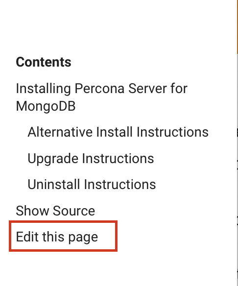

# Contributing Guide

Thank you for deciding to contribute and help us improve Percona Server for MongoDB documentation!

We welcome contributors from all users and community. By contributing, you agree to the [Percona Community code of conduct](https://github.com/percona/community/blob/main/content/contribute/coc.md).

You can contribute to documentation in the following ways:

1. **Request a doc change through a Jira issue**. If you’ve spotted a doc issue (a typo, broken links, inaccurate instructions, etc.) but don’t have time nor desire to fix it yourself - let us know about it.

	- Click the **Submit DOC bug** link on the sidebar. This opens the [Jira issue tracker](https://jira.percona.com/projects/PSMDB/issues) for the doc project.
	- Sign in (create a Jira account if you don’t have one) and click **Create** to create an issue.
	- Describe the issue you have detected in the Summary, Description, Steps To Reproduce, Affects Version fields.

2. **[Contribute to documentation yourself](#contribute-to-documentation-yourself)**. There is the **Edit this page** link that leads you to the source file of the page on GitHub. There you make changes, create a pull request that we review and add to the doc project. For details how to do it, read on.



## Contribute to documentation yourself

To contribute to documentation, learn about the following:
- [reStructured text](https://www.sphinx-doc.org/en/master/usage/restructuredtext/basics.html) markup language. It is used to write the documentation.
- [Sphinx](https://www.sphinx-doc.org/en/master/usage/quickstart.html) documentation generator. We use it to convert source ``.rst`` files to html and PDF documents.
- [git](https://git-scm.com/)
- [Docker](https://docs.docker.com/get-docker/). It allows you to run Sphinx in a virtual environment instead of installing it and its dependencies on your machine.

There are several active versions of the documentation. Each version has a branch in the repository named accordingly:
- 3.6
- 4.0
- 4.2
- 4.4

The .rst files are in the ``source`` directory. 

### Edit documentation online via GitHub

1. Click the **Edit this page** link on the sidebar. The source ``.rst`` file of the page opens in GitHub editor in your browser. If you haven’t worked with the repository before, GitHub creates a [fork](https://docs.github.com/en/github/getting-started-with-github/fork-a-repo) of it for you.

2. Edit the page. You can check your changes on the **Preview** tab.

   **NOTE**: GitHub’s native markup language is [Markdown](https://daringfireball.net/projects/markdown/) which differs from the reStructured text. Therefore, though GitHub renders titles, headings and lists properly, some rst-specific elements like variables, directives, internal links will not be rendered.

3. Commit your changes.

	 - In the *Commit changes* section, describe your changes.
	 - Select the **Create a new branch for this commit and start a pull request** option
	 - Click **Propose changes**.

4. GitHub creates a branch and a commit for your changes. It loads a new page on which you can open a pull request to Percona. The page shows the base branch - the one you offer your changes for, your commit message and a diff - a visual representation of your changes against the original page.  This allows you to make a last-minue review. When you are ready, click the **Create pull request** button.
5. Someone from our team reviews the pull request and if everything is correct, merges it into the documentation. Then it gets published on the site.

### Edit documentation locally

This option is for users who prefer to work from their computer and / or have the full control over the documentation process.

The steps are the following:

1. Fork this repository
2. Clone the repository on your machine:

```sh
git clone git@github.com:<your_name>/psmdb-docs.git
```

3. Change the directory to ``psmdb-docs`` and add the remote upstream repository:

```sh
git remote add upstream git@github.com:percona/psmdb-docs.git
```

4. Pull the latest changes from upstream

```sh
git fetch upstream
git merge upstream/<branch>
```
Make sure that your local branch and the branch you merge changes from are the same. So if you are on ``3.6`` branch, merge changes from ``upstream/3.6``.

5. Create a separate branch for your changes

```sh
git checkout -b <my_changes>
```

6. Make changes
7. Commit your changes
8. Open a pull request to Percona

### Building the documentation

To verify how your changes look, generate the static site with the documentation. This process is called *building*. You can do it in these ways:
- [Use Docker](#use-docker)
- [Install Sphinx and build locally](#install-sphinx-and-build-locally)

#### Use Docker

1. [Get Docker](https://docs.docker.com/get-docker/)
2. We use [this Docker image](https://hub.docker.com/r/ddidier/sphinx-doc) to build documentation. Run the following command:

```sh
docker run --rm -i -v `pwd`:/doc -e USER_ID=$UID ddidier/sphinx-doc:0.9.0 make clean html
```
   If Docker can't find the image locally, it first downloads the image, and then runs it to build the documentation.

3. Go to the ``build/html`` directory and open the ``index.html`` file to see the documentation.
4. Your static site will look different from the one on the web site. This is because we use a Percona theme that is rendered when the documentation is published on the web. To view the documentation with Alabaster theme, run the following command:

```sh
docker run --rm -i -v `pwd`:/doc -e USER_ID=$UID ddidier/sphinx-doc:0.9.0 sphinx-build -b html -D 'html_theme=alabaster' source build/html
```

5. To create a PDF version of the documentation, run the following command:

```sh
docker run -i -v `pwd`:/doc -e USER_ID=$UID ddidier/sphinx-doc:0.9.0 make clean latex && docker run -i -v `pwd`:/doc -e USER_ID=$UID ddidier/sphinx-doc:0.9.0 make clean latexpdf
```

The PDF document is in the ``build/latex`` folder.

#### Install Sphinx and build locally

1. Install [pip](https://pip.pypa.io/en/stable/installing/)
2. Install [Sphinx](https://www.sphinx-doc.org/en/master/usage/installation.html).
3. While in the root directory of the doc project, run the following command to build the documentation:

```sh
make clean html
```
4. Go to the ``build/html`` directory and open the ``index.html`` file to see the documentation.
5. Your static site will look different from the one on the web site. This is because we use a Percona theme that is rendered when the documentation is published on the web. To view the documentation with Alabaster theme, run the following command:

```sh
sphinx-build -b html -D 'html_theme=alabaster' source build/html
```
6. To create a PDF version of the documentation, run the following command:

```sh
make clean latexpdf
```

The PDF document is in the ``build/latex`` folder.