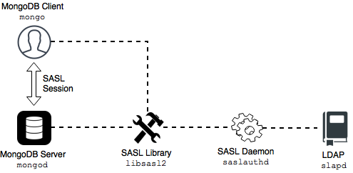

# Authentication

Authentication is the process of verifying a client’s identity. Normally, a client needs to authenticate themselves against the MongoDB server user database before doing any work or reading any data from a `mongod` or `mongos` instance.

By default, Percona Server for MongoDB provides a SCRAM authentication mechanism where clients authenticate themselves by providing their user credentials.
In addition, you can integrate Percona Server for MongoDB with a separate service, such as OpenLDAP or Active Directory. This enables users to access the database with the same credentials they use for their emails or workstations.

You can use any of these authentication mechanisms supported in Percona Server for MongoDB:

* [SCRAM](#scram) (default)
* [x.509 certificate authentication](#x509-certificate-authentication)
* [LDAP authentication with SASL](sasl-auth.md)
* [Kerberos Authentication](kerberos.md)
* [Authentication and authorization with direct binding to LDAP](authorization.md)

## SCRAM

SCRAM is the default authentication mechanism. Percona Server for MongoDB verifies the credentials against the user’s name, password and the database where the user record is created for a client (authentication database). For how to enable this mechanism, see [Enabling Authentication](enable-auth.md).

## x.509 certificate authentication

This authentication mechanism enables a client to authenticate in Percona Server for MongoDB by providing an x.509 certificate instead of user credentials. Each certificate contains the `subject` field defined in the  format. In Percona Server for MongoDB, each certificate has a corresponding user record in the `$external` database. When a user connects to the database, Percona Server for MongoDB matches the `subject` value against the usernames defined in the `$external` database.

For production use, we recommend using valid  certificates. For testing purposes, you can generate and use self-signed certificates.

x.509 authentication is compatible with with [LDAP authorization](authorization.md) to enable you to control user access and operations in Percona Server for MongoDB. For configuration guidelines, refer to [Set up x.509 authentication and LDAP authorization](x509-ldap.md).

!!! admonition "See also"

    MongoDB Documentation: [x.509](https://docs.mongodb.com/manual/core/security-x.509/)

    Percona Blog: [Setting up MongoDB with Member x509 auth and SSL + easy-rsa](https://www.percona.com/blog/2019/10/28/setting-up-mongodb-with-member-x509-auth-and-ssl-easy-rsa/)

## LDAP authentication with SASL

## Overview

LDAP authentication with  means that both the client and the server establish a SASL session using the SASL library. Then authentication (bind) requests are sent to the LDAP server through the SASL authentication daemon (`saslauthd`) that acts as a remote proxy for the `mongod` server.

The following components are necessary for external authentication to work:

* **LDAP Server**: Remotely stores all user credentials
(i.e. user name and associated password).

* **SASL Daemon**: Used as a MongoDB server-local proxy
for the remote LDAP service.

* **SASL Library**: Used by the MongoDB client and server
to create data necessary for the authentication mechanism.

The following image illustrates this architecture:

An authentication session uses the following sequence:

1. A `mongosh` client connects to a running `mongod` instance.
2. The client creates a `PLAIN` authentication request
using the SASL library.
3. The client then sends this SASL request to the server
as a special mongo command.
4. The `mongod` server receives this SASL message,
with its authentication request payload.
5. The server then creates a SASL session scoped to this client,
using its own reference to the SASL library.
6. Then the server passes the authentication payload to the SASL library,
which in turn passes it on to the `saslauthd` daemon.
7. The `saslauthd` daemon passes the payload on to the LDAP service
to get a YES or NO authentication response
(in other words, does this user exist and is the password correct).
8. The YES/NO response moves back from `saslauthd`,
through the SASL library, to `mongod`.
9. The `mongod` server uses this YES/NO response
to authenticate the client or reject the request.
10. If successful, the client has authenticated and can proceed.

For configuration instructions, refer to [Setting up LDAP authentication with SASL](sasl-auth.md).

## Kerberos Authentication

Percona Server for MongoDB supports Kerberos authentication starting from release 6.0.2-1.

This authentication mechanism involves the use of a Key Distribution Center (KDC) - a symmetric encryption component which operates with tickets. A ticket is a small amount of encrypted data which is used for authentication. It is issued for a user session and has a limited lifetime.

When using Kerberos authentication, you also operate with principals and realms.

A realm is the logical network, similar to a domain, for all Kerberos nodes under the same master KDC.

A principal is a user or a service which is known to Kerberos. A principal name is used for authentication in Kerberos. A service principal represents the service, e.g. `mongodb`. A user principal represents the user. The user principal name corresponds to the username in the `$external` database in Percona Server for MongoDB.

The following diagram shows the authentication workflow:

The sequence is the following:

1. A `mongo` client sends the Ticket-Grantng Ticket (TGT) request to the Key Distribution Center (KDC)

2. The KDC issues the ticket and sends it to the `mongo` client.

3. The `mongo` client sends the authentication request to the `mongod` server presenting the ticket.

4. The `mongod` server validates the ticket in the KDC.

5. Upon successful ticket validation, the authentication request is approved and the user is authenticated.

Kerberos authentication in Percona Server for MongoDB is implemented the same way as in MongoDB Enterprise.

!!! admonition "See also"

    MongoDB Documentation: [Kerberos Authentication](https://docs.mongodb.com/manual/core/kerberos/)

*[SCRAM]: Salted Challenge Response Authentication Mechanism

