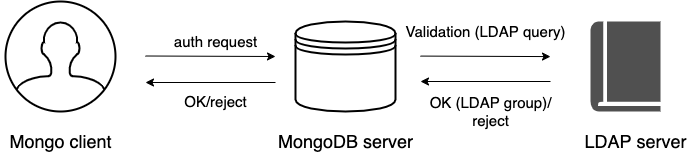

# LDAP authorization

LDAP authorization allows you to control user access and operations in your database environment using the centralized user management storage – an LDAP server. You create and manage user credentials and permission information in the LDAP server. In addition, you create roles in the `admin` database with the names that exactly match the LDAP group Distinguished Name. These roles define what privileges the users who belong to the corresponding LDAP group.

## Supported authentication mechanisms

LDAP authorization is compatible with the following authentication mechanisms:


* [x.509 certificate authentication](authentication.md#x509-certificate-authentication)

* [Kerberos Authentication](authentication.md#kerberos-authentication)

* [Authentication and authorization with direct binding to LDAP](#authentication-and-authorization-with-direct-binding-to-ldap)

## Authentication and authorization with direct binding to LDAP

Starting with release 6.0.2-1, you can configure Percona Server for MongoDB to communicate with the LDAP server directly to authenticate and also authorize users.

The advantage of using this mechanism is that it is easy to setup and does not require pre-creating users  in the dummy `$external` database. Nevertheless, the `--authenticationDatabase` connection argument will still need to be specified as `$external`.

The following example illustrates the connection to Percona Server for MongoDB from the `mongosh` shell:

```{.bash data-prompt="$"}
$ mongosh -u "CN=alice,CN=Users,DC=engineering,DC=example,DC=com" -p --authenticationDatabase '$external' --authenticationMechanism PLAIN
```

The following diagram illustrates the authentication and authorization flow:




1. A user connects to the database providing their credentials

2. If required, Percona Server for MongoDB [transforms the username](#username-transformation) to match the user in the LDAP server according to the mapping rules specified for the `--ldapUserToDNMapping` parameter.

3. Percona Server for MongoDB queries the LDAP server for the user identity and/or the LDAP groups this user belongs to.

4. The LDAP server evaluates the query and if a user exists, returns their LDAP groups.

5. Percona Server for MongoDB authorizes the user by mapping the DN of the returned groups against the roles assigned to the user in the `admin` database.  If a user belongs to several groups they receive permissions associated with every group.

### Username transformation

If clients connect to Percona Server for MongoDB with usernames that are not LDAP DN, these usernames must be converted to the format acceptable by LDAP.

To achieve this,  the `--ldapUserToDNMapping` parameter is available in Percona Server for MongoDB configuration.

The `--ldapUserToDNMapping` parameter is a JSON string representing an ordered array of rules expressed as JSON documents. Each document provides a regex pattern (`match` field) to match against a provided username. If that pattern matches, there are two ways to continue:


* If there is the `substitution` value, then the matched pattern becomes the username of the user for further processing.


* If there is the `ldapQuery` value, the matched pattern is sent to the LDAP server and the result of that LDAP query becomes the DN of the user for further processing.

Both `substitution` and `ldapQuery` should contain placeholders to insert parts of the original username – those placeholders are replaced with regular expression submatches found on the `match` stage.

So having an array of documents, Percona Server for MongoDB tries to match each document against the provided name and if it matches, the name is replaced either with the substitution string or with the result of the LDAP query.

### LDAP referrals

As of version 6.0.2-1, Percona Server for MongoDB supports LDAP referrals as defined in [RFC 4511 4.1.10](https://www.rfc-editor.org/rfc/rfc4511.txt). For security reasons, referrals are disabled by default. Double-check that using referrals is safe before enabling them.

To enable LDAP referrals, set the `ldapFollowReferrals` server parameter to `true` using the [setParameter](set-parameter.md) command or by editing the configuration file.

```yaml
setParameter:
   ldapFollowReferrals: true
```

### Connection pool

As of version 6.0.2-1, Percona Server for MongoDB always uses a connection pool to LDAP server to process bind requests. The connection pool is enabled by default. The default connection pool size is 2 connections.

You can change the connection pool size either at the server startup or dynamically by specifying the value for the `ldapConnectionPoolSizePerHost` server parameter.

For example, to set the number of connections in the pool to 5, use the [setParameter](set-parameter.md) command:

=== "Command line"

     ```{.javascript data-prompt=">"}
     > db.adminCommand( { setParameter: 1, ldapConnectionPoolSizePerHost: 5  } )
     ```

=== "Configuration file"
 
     ```yaml
     setParameter:
       ldapConnectionPoolSizePerHost: 5
     ```

### Support for multiple LDAP servers

As of version 6.0.2-1, you can specify multiple LDAP servers for failover. Percona Server for MongoDB sends bind requests to the first server defined in the list. When this server is down or unavailable, it sends requests to the next server  and so on. Note that Percona Server for MongoDB keeps sending requests to this server even after the unavailable server recovers.

Specify the LDAP servers as a comma-separated list in the format `<host>:<port>` for the [–ldapServers](https://docs.mongodb.com/manual/reference/program/mongod/index.html#cmdoption-mongod-ldapservers) option.

You can define the option value at the server startup by editing the configuration file.

```yaml
security:
  authorization: "enabled"
  ldap:
    servers: "ldap1.example.net,ldap2.example.net"
```

You can change `ldapServers` dynamically at runtime using the [setParameter](set-parameter.md).

```{.javascript data-prompt=">"}
> db.adminCommand( { setParameter: 1, ldapServers:"localhost,ldap1.example.net,ldap2.example.net"} )
{ "was" : "ldap1.example.net,ldap2.example.net", "ok" : 1 }
```

!!! admonition "See also"

    MongoDB Documentation:

    * [Authenticate and Authorize Users Using Active Directory via Native LDAP](https://docs.mongodb.com/manual/tutorial/authenticate-nativeldap-activedirectory/)
    * [LDAP referrals](https://ldapwiki.com/wiki/LDAP%20Referral)

## Configuration

For how to configure LDAP authorization with the native LDAP authentication, see [Setting up LDAP authentication and authorization using NativeLDAP](ldap-setup.md).


*[DN]: Distinguished Name