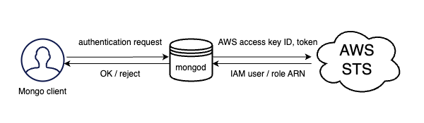

# AWS IAM authentication

!!! admonition "Version added: [6.0.5-4](release_notes/6.0.5-4.md)"

!!! important

    This is a [technical preview feature](glossary.md#technical-preview-feature)

IAM (Identity Access Management) is the AWS service that allows you to securely control access to AWS resources. Percona Server for MongoDB supports authentication with AWS IAM enabling you to use the same AWS credentials both for it and other components of your infrastructure. This saves your DBAs from managing different sets of secrets and frees their time on other activities. 

You can configure AWS IAM for a password-less authentication. Instead of username and password, the user or the application presents the AWS security credentials for authentication, but the secret key is not sent to Percona Server for MongoDB. This significantly increases the security in your infrastructure. 

Percona Server for MongoDB supports two authentication types: 

## User authentication

This authentication type is typically used by human operators. Every user account in AWS has the ARN (Amazon Resource Name), which uniquely identifies this account and the user associated with it. During authentication, the ARN is used to verify the user's identity. 

## Role authentication

This type is typically used for applications / `mongo` clients. For instance, if your application is running on AWS resources like EC2 instance or ECS (Elastic Container Service) which uses the IAM role assigned to it. Another scenario is to allow users to assume the IAM role and in such a way, grant a user the permissions outlined in the IAM role. The ARN of the IAM role is used to authenticate the application in Percona Server for MongoDB.  

For either type of AWS IAM authentication, the flow is the following:

1. A `mongo` client (a Mongo shell or an application that talks to Percona Server for MongoDB via a driver) gets AWS credentials from either EC2/ECS instance metadata service, environmental variables or MongoDB URI connection string.
2. The `mongo` client constructs the authentication request which includes the AWS access key ID, token and the signature and sends it to Percona Server for MongoDB

    !!! important 

        The `mongo` client never sends the secret access key to Percona Server for MongoDB.

3. Percona Server for MongoDB sends the received credentials to the AWS STS (Security Token Service) for verification
4. The AWS STS service validates whether the signature is correct and answers with the user / role ARN that created the signature
5. Percona Server for MongoDB looks for the same username as the received ARN in the `$external` database and grants privileges to access Percona Server for MongoDB as defined for the respective user.

Starting with version [6.0.8-6](release_notes/6.0.8-6.md), you can [configure the AWS STS endpoint](aws-iam-setup.md#configure-aws-sts-endpoint) by specifying the `setParameter.awsStsHost` in the configuration file. This allows you to send requests to the AWS resources of your choice to meet security requirements of your organization and ensure successful authentication. 

!!! admonition "See also"

    * AWS documentation: 

        * [AWS Identity and Access Management](https://docs.aws.amazon.com/IAM/latest/UserGuide/introduction.html)
        * [Temporary security credentials in IAM](https://docs.aws.amazon.com/IAM/latest/UserGuide/id_credentials_temp.html#sts-introduction)
        * [Authenticating Requests (AWS Signature Version 4)](https://docs.aws.amazon.com/AmazonS3/latest/API/sig-v4-authenticating-requests.html)
        * [Managing AWS STS in an AWS Region](https://docs.aws.amazon.com/IAM/latest/UserGuide/id_credentials_temp_enable-regions.html)

    * MongoDB documentation: [Set Up Passwordless Authentication with AWS IAM](https://www.mongodb.com/docs/atlas/security/passwordless-authentication/#std-label-passwordless-auth-aws-no-saml)

## Configuration 

For how to configure AWS IAM authentication, see [Setting up AWS IAM authentication](aws-iam-setup.md).

*[AWS]: Amazon Web Service
*[IAM]: Identity Access Management
