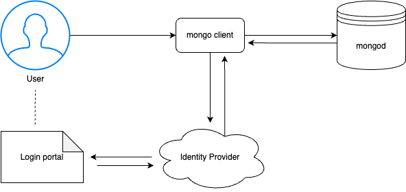

# OIDC authentication

!!! note "Version added: [7.0.24-13](release_notes/7.0.24-13.md)"


OpenID Connect (OIDC) is an identity authentication protocol built on top of the OAuth 2.0 framework. OIDC is designed to verify user identities and provide authentication, ensuring that users are who they claim to be. OAuth 2.0 is used for user authorization to access resources. 

The OIDC / OAuth 2.0 support enables Percona Server for MongoDB to authenticate and authorize users via tokens issued by an identity provider (IdP). The latter serves as a centralized storage of user credentials, which are not shared with either Percona Server for MongoDB or MongoDB clients.

The IdP is a centralized place to authenticate and authorize humans and applications to access multiple resources in your infrastructure. User credentials, access policies and roles are managed centralized on the IdP side. You can configure different access policies and tailor permissions for a group of users of a specific user. 

## Supported external identity providers

Percona Server for MongoDB supports the following external identity providers:

* [Okta :octicons-link-external-16:](https://www.okta.com/)
* [Microsoft Entra :octicons-link-external-16:](https://www.microsoft.com/en-gb/security/business/microsoft-entra)
* [Ping Identity:octicons-link-external-16:](https://www.pingidentity.com/en.html)
* [Keycloak :octicons-link-external-16:](https://www.keycloak.org/)

Any other external identity provider that supports OIDC and OAuth 2.0 may also work. However, we haven't tested them and cannot guarantee their compatibility.

## Authentication workflow

Percona Server for MongoDB supports two authentication workflows with OIDC:

* **Authorization code**: A MongoDB client (for example, `mongosh` or Compass) opens a browser and redirects a user to the login portal of an external identity provider to pass authentication. This is the most common and secure flow for interactive user sessions. It is suitable for use cases when users have a web browser available on the machine where they are running the MongoDB client.

* **Device authentication**: Instead of redirecting a user to authenticate on a login portal directly, a MongoDB client receives the URL of the login portal and the authentication code. The user authenticates using a separate device, following the URL and entering the authentication code. The example use case for such a workflow is when both a MongoDB client works in an environment without a browser, e.g. on a CLI-only server. 

The following diagram illustrates the authentication flow.



1. A user connects to Percona Server for MongoDB using a MongoDB client. The client must support OIDC.
2. Percona Server for MongoDB redirects the MongoDB client to the IdP for authentication and provides the IdP information such as URL, requests scopes, clientID. 
3. The MongoDB client requests authentication from the IdP.
4. The IdP generates the authorization code. A user is redirected to the login portal of an external identity provider (IdP). Alternatively, a user is provided with a URL and the authentication code.
5. The user is requested to authenticate. For example, using two-factor authentication or by entering an authentication code.
6. A user is redirected back to the MongoDB client with a temporary single-use authorization code. 
7. The MongoDB client sends the authorization code to the IdP and requests tokens. The request includes the `clientId` and credentials of the MongoDB client.
8. The IdP verifies the authorization code, user's client ID and credentials.
9. Upon success, the IdP returns the access and ID tokens to the MongoDB client.
10. The MongoDB client uses the access token to access Percona Server for MongoDB.

The access and ID tokens must be encoded as JSON Web Tokens (JWT). They contain information about user identities and authorization rights.

You can use the IdP infrastructure to authenticate and authorize users. In this case, you store and manage users and their access rights on the IdP side. To use this flow, your IdP configuration in PSMDB must include the `useAuthorizationClaim` option set to true. This setting enforces the use of IdP groups to authorize users and grant them access to Percona Server for MongoDB resources. 

Alternatively, you can use OIDC to only authenticate users. Then you can authorize them either based on the roles defined in PSMDB or use an external solution like an LDAP server.
In this case, the `useAuthorizationClaim` option must be set to false.  To learn more about OIDC authentication and LDAP authorization, see [Setting up OIDC authentication and LDAP authorization](oidc-ldap.md)

## Benefits

The use of OIDC and OAuth 2.0 provides the following benefits:

* streamlines authentication and authorization flow, 
* simplifies user management and configuration: everything is done in a single place
* enables you to use modern authentication techniques like 2FA, MFA and others supported by IdP
* improves security as credentials are not sent to nor stored in Percona Server for MongoDB. 
* reduces cross-application risk - access tokens are granted for specific resources using audience claims. If a token is compromised, the token has a limited lifetime and scope to limit access.

## Configuration 

To configure OIDC /OAuth 2.0 authentication and authorization, you must do the following:

1. Configure external identity provider
2. Configure authentication in Percona Server for MongoDB
3. Configure user roles and privileges in Percona Server for MongoDB that will be mapped to IdP groups

This section describes Percona Server for MongoDB configuration for OIDC authentication and the available configuration options. Refer to tutorials for detailed step-by-step instructions:

* [Configure OIDC with Okta](oidc-okta.md)
* [Configure OIDC with Microsoft Entra](oidc-entra.md)
* [Configure OIDC with Ping Identity](oidc-ping.md)
* [Configure OIDC with Keycloak](oidc-keycloak.md)
* [Configure OIDC authentication and LDAP authorization](oidc-ldap.md)

### Percona Server for MongoDB configuration options

To configure OIDC authentication in Percona Server for MongoDB, specify the external identity provider configuration for the `oidcIdentityProviders` server parameter. You can set it only at startup. See the [Parameter tuning guide](set-parameter.md) for how to set server parameters.

You can use several IdPs for OIDC authentication with human flow, where a user is redirected to authentication portal. In this case, you must add a configuration for every provider to the `oidcIdentityProviders` server parameter. You must also specify a match pattern for each provider. Usernames are then matched against the match pattern to identify which IdP to authenticate a user with. The order in which IdPs are listed defines their priority. The first IdP that matches the username is used for authentication.

The `oidcIdentityProviders` server parameter contains an array of JSON objects with the following parameters:

| Parameter  | Required    | Description |
|------------|-------------|-------------| 
| `issuer`   | Yes         | The URL of the identity provider that the server should accept tokens from. It must be a valid URL that starts with `https://`. You may use multiple IdPs with the same `issuer` value. In this case, the `audience` value must be unique. |
| `audience` | Yes         | The audience claim for the identity provider. It is used to verify that the access token is intended for your application. You can specify only one value for the `audience` field. The `audience` field must have a unique value for the same IdP with the same `issuer` field. |
| `authNamePrefix` | Yes   | The unique prefix for the authentication name. It is used to identify the identity provider in the authentication process. |
| `useAuthorizationClaim`| No| If set to `true`, the server uses the claim in the access token to map user roles to MongoDB roles. If set to `false`, the server uses the `$external` database for authentication and authorization. The default value is `true`. |
| `authorizationClaim` | Yes when `useAuthorizationClaim` is `true` | The claim in the access token that contains the user roles or groups. It is used to map user roles to MongoDB roles.|
| `clientId` | Yes (if `supportsHumanFlows` is `true`) | The client ID of the application registered with the identity provider. It is used to identify your application when requesting tokens. |
| `matchPattern` | Yes (if more than one IdP with human authentication support is used) | A regular expression that matches usernames to identify which identity provider to use for authentication. |
| `requestScopes` | No | Specifies the user information (claims) that an application wants to access during authentication. Scopes are essentially a way for the application to request specific sets of user attributes from the identity provider.  |
| `principalName` | No | Specifies the name of the principal that is used to authenticate users. If not specified, the default value is `sub`, which is the subject claim in the access token. The subject claim typically contains a unique identifier for the user. You can use other claims like `email` or `preferred_username` as a principal name. |
| `supportsHumanFlows`| No | Defines whether an identity provider supports human authentication flows. This means that the identity provider can redirect users to a login portal or provide a URL and authentication code for device authentication. This option affects the `clientId` and `matchPattern` fields. <br> You may set it to false for machine workload IdPs to bypass the `clientId` when it's not needed.|

#### Examples 

=== "Single IdP"

    This is the example configuration of Percona Server for MongoDB for Okta:    

    === "Configuration file"

        ```yaml
        security:
           authorization: enabled
        setParameter:
           authenticationMechanisms: MONGODB-OIDC
           oidcIdentityProviders: '[ {
              "issuer": "https://my-okta.okta.com",
              "audience": "example@my-company.com",
              "authNamePrefix": "okta",
              "useAuthorizationClaim": true,
              "authorizationClaim": "oidc-test",
              "clientId": "0zzw3ggfd2ase33"
           } ]'
        ```

    === "Command line"
   
        ```bash
        mongod --auth --setParameter authenticationMechanisms=MONGODB-OIDC --setParameter \
        'oidcIdentityProviders=[ {
           "issuer": "https://my-okta.okta.com",
           "audience": "example@my-company.com",
           "authNamePrefix": "okta",
           "useAuthorizationClaim": true,
           "authorizationClaim": "oidc-test",
           "clientId": "0zzw3ggfd2ase33"
        } ]'
        ```


=== "Several IdPs"
 
    For example, if you have two identity providers, Okta and Microsoft Entra, you can specify the following configuration:

    === "Configuration file"

        ```yaml
        security:
           authorization: enabled
        setParameter:
           authenticationMechanisms: MONGODB-OIDC
           oidcIdentityProviders: '[ {
              "issuer": "https://my-okta.okta.com",
              "audience": "audience1",
              "authNamePrefix": "okta",
              "useAuthorizationClaim": true,
              "authorizationClaim": "oidc-test",
              "matchPattern": "@okta.com$",
              "clientId": "0zzw3ggfd2ase33"
           }, {
              "issuer": "https://azure-test.azure.com",
              "audience": "audience2",
              "authNamePrefix": "azure-issuer",
              "useAuthorizationClaim": true,
              "authorizationClaim": "azure-test",
              "matchPattern": "@azure.com$",
              "clientId": "1zzw3ggfd2ase33"
           } ]'
        ```

    === "Command line"
   
        ```bash
         mongod --auth --setParameter authenticationMechanisms=MONGODB-OIDC --setParameter \
         oidcIdentityProviders: '[ {
            "issuer": "https://my-okta.okta.com",
            "audience": "audience1",
            "authNamePrefix": "okta",
            "useAuthorizationClaim": true,
            "authorizationClaim": "oidc-test",
            "matchPattern": "@okta.com$",
            "clientId": "0zzw3ggfd2ase33"
         }, {
            "issuer": "https://azure-test.azure.com",
            "audience": "audience2",
            "authNamePrefix": "azure-issuer",
            "useAuthorizationClaim": true,
            "authorizationClaim": "azure-test",
            "matchPattern": "@azure.com$",
            "clientId": "1zzw3ggfd2ase33"
         } ]'
        ```


Additionally, you can configure how often Percona Server for MongoDB can re-fetch public keys from your identity provider (IdP). It may be required when a new public key is presented.

The `JWKSMinimumQuiescePeriodSecs` server parameter sets the minimum time that must pass between fetches of the IdP's `JWKSetURI` endpoint.

```yaml
setParameter:
   JWKSMinimumQuiescePeriodSecs: 60
```

The default value is 60 seconds, meaning that Percona Server for MongoDB will wait at least 1 minute before trying to fetch the keys again from the IdP. If you change an RSA public key multiple times within this period, the key may not function correctly for up to one minute unless you decrease this value.

If you set `JWKSMinimumQuiescePeriodSecs` to zero, Percona Server for MongoDB will fetch the keys immediately every time it sees a new key ID (kid). 

You can set the `JWKSMinimumQuiescePeriodSecs` parameter for `mongod` and `mongos` at startup and during runtime.  


