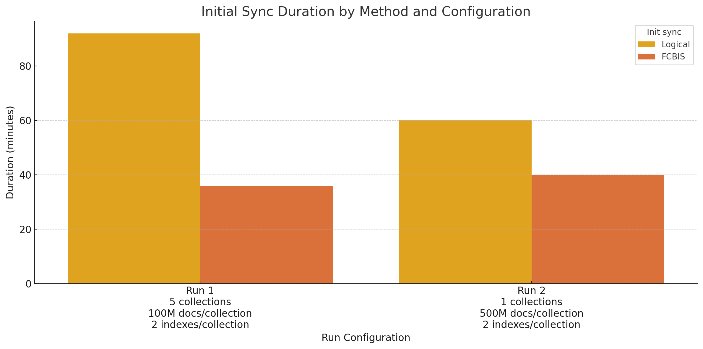

title: Percona Server for MongoDB 8.0.12-4 ({{date.8_0_12}})
summary: Learn about improvements, new features, and bug and security vulnerability fixes in this release
authors:
    - Anastasia Alexandrova
version: 8.0.12-4
---

# Percona Server for MongoDB {{ page.meta.version }} ({{date.8_0_12}}) 

[Install](../install/index.md){.md-button}
[Upgrade from MongoDB Community](../install/upgrade-from-mongodb.md){.md-button}

Percona Server for MongoDB {{ page.meta.version }} is an enhanced, source-available, and highly-scalable database that is a
fully-compatible, drop-in replacement for MongoDB Community Edition.

Percona Server for MongoDB {{ page.meta.version }} includes the improvements and bug fixes of [MongoDB 8.0.9 Community Edition](https://www.mongodb.com/docs/manual/release-notes/8.0/#8.0.9---may-1--2025), [MongoDB 8.0.10 Community Edition](https://www.mongodb.com/docs/manual/release-notes/8.0/#8.0.10---jun-04--2025), [MongoDB 8.0.11 Community Edition](https://www.mongodb.com/docs/manual/release-notes/8.0/#8.0.11---jun-30--2025), [MongoDB 8.0.12 Community Edition](https://www.mongodb.com/docs/manual/release-notes/8.0/#8.0.12---july-23--2025). 

It also includes the fix for security vulnerability [CVE-2025-6714](https://nvd.nist.gov/vuln/detail/CVE-2025-6714) reported in [SERVER-106753](https://jira.mongodb.org/browse/SERVER-106753).  

Percona Server for MongoDB {{ page.meta.version }} supports protocols and drivers of MongoDB Community 8.0.9 through 8.0.12.

## Release Highlights

This release provides the following features and improvements:

### Boost performance during cluster restore and scaling with file copy-based initial sync

You can now select how a newly added or a restored replica set member synchronizes the data from other members - via logical or file copy-based initial sync. File copy-based initial sync copies physical files from the source node. This sync method is faster than the logical one and it reduces your maintenance time on scaling your cluster.

The performance advantage of file copy-based over logical initial sync varies based on data set characteristics. While file copy-based initial sync can be significantly quicker, its efficiency is influenced by factors such as document count, collection distribution, and indexing structure.

This feature is available in Percona Server for MongoDB Pro out of the box. [Become a Percona Customer](https://www.percona.com/about/contact) to enjoy all Pro features with little to no effort from your side. Alternatively, you can receive it by building Percona Server from the source code.

*Update from {{date.pro_eol}}: We no longer release Percona Server for MongoDB Pro Builds. All features included in Pro Builds are accessible for everyone in our public regular builds. If you need a Pro Build for that specific version, please contact your Percona representative for guidance. We're here to help ensure a smooth transition and continued success with Percona open-source solutions.*

### Enhance authentication security via a token-based authentication flow with OpenID Connect (OIDC)

Percona Server for MongoDB now supports OpenID Connect (OIDC) / OAuth 2.0, providing a secure and simple way to manage user authentication using identity and access tokens. This feature allows you to centralize user management with a single identity provider, enhance security by eliminating the need to store credentials in your database and reduce the risk of credential theft. You can leverage enhanced authentication techniques like Single Sign-On (SSO) and Multi-Factor Authentication (MFA), improving your overall security posture and user experience.

Learn more about OIDC connect in our [documentation](../oidc.md)

This feature is available in [Percona Server for MongoDB Pro](../psmdb-pro.md) out of the box. You can also receive it by building Percona Server from the source code.

### Packaging changes

Percona Server for MongoDB {{ page.meta.version }} is no longer supported on Ubuntu 20.04 (Focal Fossa) as this operating system has reached end of life. If you're not ready to upgrade to a newer Ubuntu OS but still want to update Percona Server for MongoDB, [contact us](https://hubs.ly/Q03rRtDg0)! We're here to make your databases run better.

### Upstream Improvements

The bug fixes, provided by MongoDB Community Edition and included in Percona Server for MongoDB, are the following:

* [SERVER-106753](https://jira.mongodb.org/browse/SERVER-106753) - Fixed the issue with incorrect handling of incomplete data that may prevent `mongos` from accepting new connections. The issue affects deployments configured to use a load balancer like HAProxy and affects Percona Server for MongoDB Server v6.0 prior to 6.0.23, Percona Server for MongoDB Server v7.0 prior to 7.0.20 and Percona Server for MongoDB Server v8.0 prior to 8.0.12. We recommend users to upgrade to the latest version as soon as possible.
* [SERVER-92236](https://jira.mongodb.org/browse/SERVER-92236) - Fixed an issue where servers performing chunk migrations could experience continuous memory growth caused by the cancellation mechanism for migration operations not properly releasing memory. 
* [SERVER-92806](https://jira.mongodb.org/browse/SERVER-92806) -  Tracked nested paths through MatchExpression trees while encoding indexability for plan cache entries
* [SERVER-96197](https://jira.mongodb.org/browse/SERVER-96197) - Fixed the issue with retrieving the wrong resolved namespace for a collection when there are multiple collections with the same name involved in a query
* [SERVER-100785](https://jira.mongodb.org/browse/SERVER-100785) - Fixed the issue with config server crashing after issuing a `reshardCollection` command with malformed `zones` by adding a validation for zone ranges
* [SERVER-105375](https://jira.mongodb.org/browse/SERVER-105375) - Resolved a bug where queries using the $elemMatch operator with an expression that could never be true would incorrectly trigger a full collection scan. The server now correctly applies an efficient plan to immediately return an empty result, which prevents unnecessary work and restores optimal query performance.
* [SERVER-106614](https://jira.mongodb.org/browse/SERVER-106614) - Fixed the issue with `mongos` router not being able to connect to a replica set shards that were added prior to MongoDB 8.0 and miss the replSetConfigVersion in the config.shards collection. The issue is fixed by matching `config.shards` entries without `replSetConfigVersion`.
* [SERVER-95523](https://jira.mongodb.org/browse/SERVER-95523) -  Fixed a race condition where a concurrent `upsert` operation could incorrectly fail with a `DuplicateKey` error instead of retrying as an update. With this fix, the upsert operation now correctly retries and applies the update when another operation inserts the document in parallel. 
* [SERVER-95524](https://jira.mongodb.org/browse/SERVER-95524) - Avoided retrying on duplicate key error for upserts in multi-document transactions
* [SERVER-97368](https://jira.mongodb.org/browse/SERVER-97368) - Enabled TTL deletes on time-series collections containing data prior to 1970
* [SERVER-99342](https://jira.mongodb.org/browse/SERVER-99342) - Fixed the issue with internal metrics for throughput decreases not being correctly recorded. This issue caused inaccurate reporting of throughput changes

Find the full list of changes in the release notes for:

* [MongoDB 8.0.9 Community Edition](https://www.mongodb.com/docs/manual/release-notes/8.0/#8.0.9---may-1--2025), 
* [MongoDB 8.0.10 Community Edition](https://www.mongodb.com/docs/manual/release-notes/8.0/#8.0.10---jun-04--2025), 
* [MongoDB 8.0.11 Community Edition](https://www.mongodb.com/docs/manual/release-notes/8.0/#8.0.11---jun-30--2025), 
* [MongoDB 8.0.12 Community Edition](https://www.mongodb.com/docs/manual/release-notes/8.0/#8.0.12---july-23--2025). 

## Changelog

### New Features

* [PSMDB-1284](https://perconadev.atlassian.net/browse/PSMDB-1284) - Add the ability to perform file copy-based initial sync
* [PSMDB-1438](https://perconadev.atlassian.net/browse/PSMDB-1438) - Add the ability to authenticate users using OpenID Connect (OIDC)

### Improvements

* [PSMDB-1619](https://perconadev.atlassian.net/browse/PSMDB-1619) - Make log rotation behavior compatible with MongoDB Community and MongoDB Enterprise Advanced by renaming existing log file to a name with a timestamp and starting a new one
* [PSMDB-1633](https://perconadev.atlassian.net/browse/PSMDB-1633) - Implemented 'encryptionAtRest' field in 'serverStatus()'
* [PSMDB-1634](https://perconadev.atlassian.net/browse/PSMDB-1634) - Improved the `mongod.1` manpage by adding reference to official documentation

### Fixed Bugs

* [PSMDB-1615](https://perconadev.atlassian.net/browse/PSMDB-1615) - Fixed the issue with corrupt/unusable debug files in RPM-based systems for Percona Server for MongoDB 6, 7 and 8

* [PSMDB-1679](https://perconadev.atlassian.net/browse/PSMDB-1679) - Fixed the issue with Percona Server for MongoDB not starting with custom configurations (Thank you Ilnar Gabidullin for reporting this issue)

* [PSMDB-1712](https://perconadev.atlassian.net/browse/PSMDB-1712) - Fixed the issue with the server сrash when accessing LDAP by improving the `start_poll` function behavior

* [PSMDB-1730](https://perconadev.atlassian.net/browse/PSMDB-1730) - Fixed the issue with LDAP authentication via SASL by adding the package `cyrus-sasl-plain` in Docker images for Percona Server for MongoDB 6, 7 and 8

* [PSMDB-1745](https://perconadev.atlassian.net/browse/PSMDB-1745) - Aligned the audit log rotation behavior when the server is started with the `reopen` behavior so that on startup the server keeps writing events to the same log file.

* [PSMDB-1754](https://perconadev.atlassian.net/browse/PSMDB-1754) - Fixed the issue with log rotation behavior that was caused by replacing the rotated audit log file with a timestamp if it existed. The fix is to reopen a current audit log file in the append mode and write events there. 