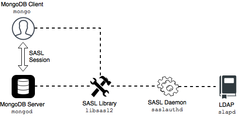
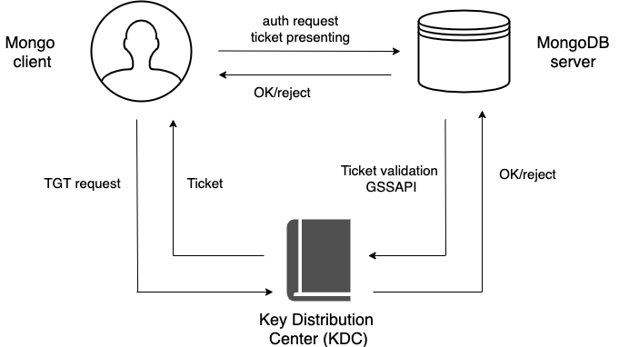

.. _ext-auth:

=======================
Authentication
=======================

Authentication is the process of verifying a client's identity. Normally, a client needs to authenticate themselves
against the MongoDB server user database before doing any work
or reading any data from a ``mongod`` or ``mongos`` instance. 

By default, |PSMDB| provides a :abbr:`SCRAM (Salted Challenge Response Authentication Mechanism)` authentication mechanism where clients authenticate themselves by providing their user credentials.   
In addition, you can integrate |PSMDB| with a separate service,
such as OpenLDAP or Active Directory. This enables users to access the database
with the same credentials they use for their emails or workstations. 

You can use any of these authentication mechanisms supported in |PSMDB|:

- :ref:`scram` (default)
- :ref:`x509`
- :ref:`ldap-authentication-sasl`
- :ref:`kerberos-authentication`
- :ref:`native-ldap`

.. _scram:

SCRAM
=====
:abbr:`SCRAM (Salted Challenge Response Authentication Mechanism)` is the default authentication mechanism. |PSMDB| verifies the credentials against the user's name, password and the database where the user record is created for a client (authentication database). For how to enable this mechanism, see :ref:`enable-auth`.

.. _x509:

x.509 certificate authentication
================================

This authentication mechanism enables a client to authenticate in |PSMDB| by providing an x.509 certificate instead of user credentials. Each certificate contains the ``subject`` field defined in the :abbr:`DN (Distinguished Name)` format. In |PSMDB|, each certificate has a corresponding user record in the ``$external`` database. When a user connects to the database, |PSMDB| matches the ``subject`` value against the usernames defined in the ``$external`` database. 

For production use, we recommend using valid :abbr:`CA (Certified Authority)` certificates. For testing purposes, you can generate and use self-signed certificates.

.. seealso::

   MongoDB Documentation: `x.509 <https://docs.mongodb.com/manual/core/security-x.509/>`_

   Percona Blog: `Setting up MongoDB with Member x509 auth and SSL + easy-rsa <https://www.percona.com/blog/2019/10/28/setting-up-mongodb-with-member-x509-auth-and-ssl-easy-rsa/>`_

.. _ldap-authentication-sasl:
   
LDAP authentication with SASL
=====================================

.. contents::
   :local:
   :depth: 1

Overview
========

LDAP authentication with |SASL| means that both the client and the server establish a SASL session using the SASL library. Then authentication (bind) requests are sent to the LDAP server through the SASL authentication daemon (``saslauthd``) that acts as a remote proxy for the ``mongod`` server.

The following components are necessary for external authentication to work:

* **LDAP Server**: Remotely stores all user credentials
  (i.e. user name and associated password).
* **SASL Daemon**: Used as a MongoDB server-local proxy
  for the remote LDAP service.
* **SASL Library**: Used by the MongoDB client and server
  to create data necessary for the authentication mechanism.

The following image illustrates this architecture:

An authentication session uses the following sequence:

1. A ``mongo`` client connects to a running ``mongod`` instance.
#. The client creates a ``PLAIN`` authentication request
   using the |SASL| library.
#. The client then sends this SASL request to the server
   as a special Mongo command.
#. The ``mongod`` server receives this SASL Message,
   with its authentication request payload.
#. The server then creates a SASL session scoped to this client,
   using its own reference to the SASL library.
#. Then the server passes the authentication payload to the SASL library,
   which in turn passes it on to the ``saslauthd`` daemon.
#. The ``saslauthd`` daemon passes the payload on to the LDAP service
   to get a YES or NO authentication response
   (in other words, does this user exist and is the password correct).
#. The YES/NO response moves back from ``saslauthd``,
   through the SASL library, to ``mongod``.
#. The ``mongod`` server uses this YES/NO response
   to authenticate the client or reject the request.
#. If successful, the client has authenticated and can proceed.  

For configuration instructions, refer to :ref:`sasl`.

.. _kerberos-authentication:

Kerberos Authentication
==============================

|PSMDB| supports Kerberos authentication starting from release 4.2.6-6. 

This authentication mechanism involves the use of a Key Distribution Center (KDC) - a symmetric encryption component which operates with tickets. A ticket is a small amount of encrypted data which is used for authentication. It is issued for a user session and has a limited lifetime.

The following diagram shows the authentication workflow: 

The sequence is the following:

1. A ``mongo`` client sends the Ticket-Grantng Ticket (TGT) request to the Key Distribution Center (KDC)
2. The KDC issues the ticket and sends it to the ``mongo`` client.
3. The ``mongo`` client sends the authentication request to the ``mongo`` server presenting the ticket.
4. The ``mongo`` server validates the ticket in the KDC.
5. Upon successful ticket validation, the authentication request is approved and the user is authenticated.   

Kerberos authentication in |PSMDB| is implemented the same way as in |mongodb| Enterprise.

.. seealso::

   |mongodb| Documentation: `Kerberos Authentication <https://docs.mongodb.com/manual/core/kerberos/>`_  
   

.. |SASL| replace:: :abbr:`SASL (Simple Authentication and Security Layer)`

.. include:: .res/replace.txt
