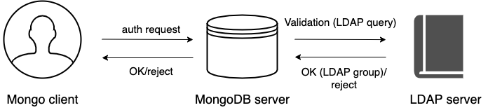

.. _ext-auth:

=======================
External Authentication
=======================

Normally, a client needs to authenticate themselves
against the MongoDB server user database before doing any work
or reading any data from a ``mongod`` or ``mongos`` instance.
External authentication allows the MongoDB server
to verify the client's user name and password against a separate service,
such as OpenLDAP or Active Directory. This allows users accessing the database
with the same credentials they use for their emails or workstations.

|PSMDB| supports the following external authentication mechanisms:

-  :ref:`ldap-authentication-sasl`
-  :ref:`ldap-authorization`   
-  :ref:`kerberos-authentication`

.. _ldap-authentication-sasl:
   
LDAP authentication with SASL
=====================================

.. contents::
   :local:
   :depth: 1

Overview
========

LDAP authentication with |SASL| means that both the client and the server establish a SASL session using the SASL library. Then authentication (bind) requests are sent to the LDAP server through the SASL authentication daemon (``saslauthd``) that acts as a remote proxy for the ``mongod`` server.

The following components are necessary for external authentication to work:

* **LDAP Server**: Remotely stores all user credentials
  (i.e. user name and associated password).
* **SASL Daemon**: Used as a MongoDB server-local proxy
  for the remote LDAP service.
* **SASL Library**: Used by the MongoDB client and server
  to create data necessary for the authentication mechanism.

The following image illustrates this architecture:

.. image:: psmdb-ext-auth.png
   :align: center

An authentication session uses the following sequence:

1. A ``mongo`` client connects to a running ``mongod`` instance.
#. The client creates a ``PLAIN`` authentication request
   using the SASL library.
#. The client then sends this SASL request to the server
   as a special Mongo command.
#. The ``mongod`` server receives this SASL Message,
   with its authentication request payload.
#. The server then creates a SASL session scoped to this client,
   using its own reference to the SASL library.
#. Then the server passes the authentication payload to the SASL library,
   which in turn passes it on to the ``saslauthd`` daemon.
#. The ``saslauthd`` daemon passes the payload on to the LDAP service
   to get a YES or NO authentication response
   (in other words, does this user exist and is the password correct).
#. The YES/NO response moves back from ``saslauthd``,
   through the SASL library, to ``mongod``.
#. The ``mongod`` server uses this YES/NO response
   to authenticate the client or reject the request.
#. If successful, the client has authenticated and can proceed.
   

For configuration instructions, refer to :ref:`sasl`.

.. _ldap-authorization:

Authentication and authorization with direct binding to LDAP
============================================================

Starting from release 4.2.5-5, |psmdb| supports |ldap-authorization|.
  
This feature has been supported in |mongodb-e| since its version 3.4. 
This authentication method means that the ``mongod`` server communicates with the LDAP server directly to authenticate and authorize users. The authorization is done by matching the user groups defined on the LDAP server against the user roles defined in |PSMDB| and thus determine user permissions. If a user belongs to several groups they receive permissions associated with every group. 

  
As of version 4.2.10-11, |psmdb| supports LDAP referrals as defined in `RFC 4511 4.1.10 <https://www.rfc-editor.org/rfc/rfc4511.txt>`_. For security reasons, referrals are disabled by default. Double-check that using referrals is safe before enabling them.

To enable LDAP referrals, set the ``ldapFollowReferrals`` server parameter to ``true`` using the :ref:`setParameter <setParameter>` command or by editing the configuration file.

.. code-block:: yaml

   setParameter:
      ldapFollowReferrals: true

.. rubric:: Connection pool

As of version 4.2.10-11, |PSMDB| always uses a connection pool to LDAP server to process authentication requests. The connection pool is enabled by default. The default connection pool size is 2 connections. 

You can change the connection pool size either at the server startup or dynamically by specifying the value for the ``ldapConnectionPoolSizePerHost`` server parameter. 

For example, to set the number of connections in the pool to 5, use the ``setParameter`` command: 

.. code-block:: text

   $ db.adminCommand( { setParameter: 1, ldapConnectionPoolSizePerHost: 5  } )

Alternatively, edit the configuration file:

.. code-block:: yaml

   setParameter:
     ldapConnectionPoolSizePerHost: 5

.. rubric:: Support for multiple LDAP servers

As of version 4.2.12-13, you can specify multiple LDAP servers for failover. |PSMDB| sends authentication requests to the first server defined in the list. When this server is down or unavailable, it sends requests to the next server  and so on. Note that |PSMDB| keeps sending requests to this server even after the unavailable server recovers.

Specify the LDAP servers as a comma-separated list in the format ``<host>:<port>`` for the `--ldapServers <https://docs.mongodb.com/manual/reference/program/mongod/index.html#cmdoption-mongod-ldapservers>`_ option. 

You can define the option value at the server startup by editing the configuration file.

.. code-block:: yaml

   security:
     authorization: "enabled"
     ldap:
       servers: "ldap1.example.net,ldap2.example.net"

You can change ``ldapServers`` dynamically at runtime using the :ref:`setParameter <setParameter>`.

.. code-block:: text

   $ db.adminCommand( { setParameter: 1, ldapServers:"localhost,ldap1.example.net,ldap2.example.net"} )
   { "was" : "ldap1.example.net,ldap2.example.net", "ok" : 1 }

.. seealso::
  
   - |mongodb| Documentation:
       - `LDAP Authorization <https://docs.mongodb.com/manual/core/security-ldap-external/>`_	    
       - `Authenticate and Authorize Users Using Active Directory via Native LDAP <https://docs.mongodb.com/manual/tutorial/authenticate-nativeldap-activedirectory/>`_
   - `LDAP referrals <https://ldapwiki.com/wiki/LDAP%20Referral>`_

.. _kerberos-authentication:

Kerberos Authentication
==============================

|PSMDB| supports Kerberos authentication starting from release 4.2.6-6. 

This authentication method involves the use of a Key Distribution Center (KDC) - a symmetric encryption component which operates with tickets. A ticket is a small amount of encrypted data which is used for authentication. It is issued for a user session and has a limited lifetime.

The following diagram shows the authentication workflow: 

.. image:: _static/images/Kerberos_auth.png

The sequence is the following:

1. A ``mongo`` client sends the Ticket-Grantng Ticket (TGT) request to the Key Distribution Center (KDC)
2. The KDC issues the ticket and sends it to the ``mongo`` client.
3. The ``mongo`` client sends the authentication request to the ``mongo`` server presenting the ticket.
4. The ``mongo`` server validates the ticket in the KDC.
5. Upon successful ticket validation, the authentication request is approved and the user is authenticated.   

Kerberos authentication in |PSMDB| is implemented the same way as in |mongodb| Enterprise.

.. seealso::

   |mongodb| Documentation:
         - `Kerberos Authentication <https://docs.mongodb.com/manual/core/kerberos/>`_	 
   

.. |SASL| replace:: :abbr:`SASL (Simple Authentication and Security Layer)`

.. include:: .res/replace.txt
